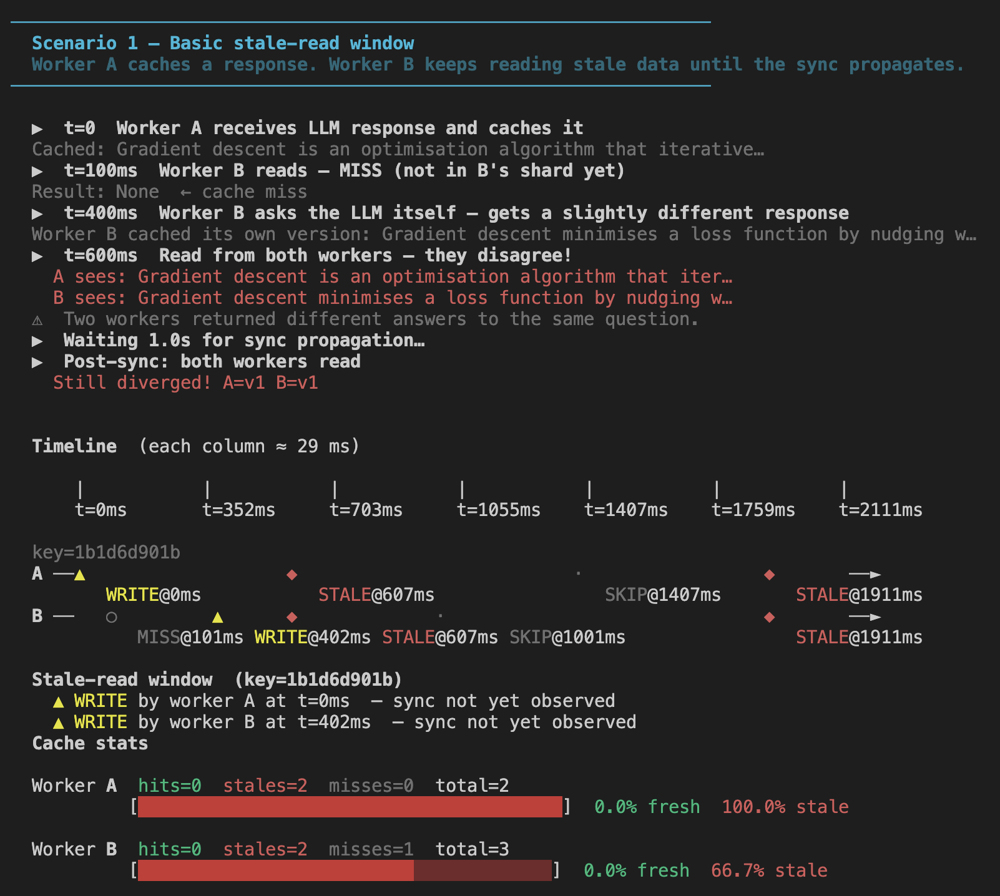
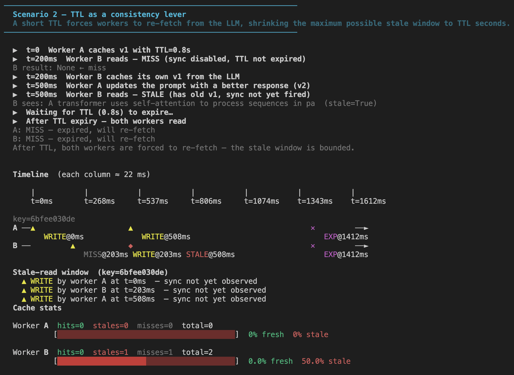
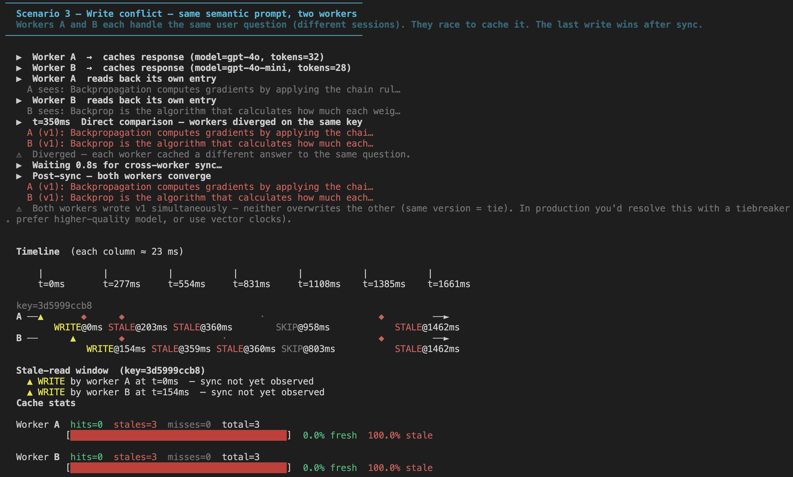

# LLM Cache — Eventual Consistency

Simulates an LLM response cache shared across two workers and makes the **stale-read window** tangible — with a timeline that shows exactly when a worker is reading outdated data, how wide the window is in milliseconds, and what closes it.

Built as part of a distributed-systems learning series. Follows on from the CAP store (topics 01–05); topics 07 onward (consensus, transactions) build on these ideas.

---

## Quick start

```bash
git clone https://github.com/aarshitaacharya/llm_cache.git
cd llm_cache
make           # runs all three scenarios (~4 seconds of real timing)
make fast      # same output, no sleeps (~2 seconds)
```

No dependencies beyond the Python standard library. Python 3.10+ required.

---

## Commands

| Command | What it runs |
|---|---|
| `make` | All three scenarios with real timing |
| `make stale` | Scenario 1: basic stale-read window |
| `make ttl` | Scenario 2: TTL as a consistency lever |
| `make conflict` | Scenario 3: concurrent write conflict |
| `make fast` | All scenarios without `sleep()` pauses |
| `make clean` | Remove Python cache files |

---

## The three scenarios

### Scenario 1 — Basic stale-read window

Worker A caches an LLM response. Worker B reads from the cache before the sync propagates — it gets a `MISS`, calls the LLM itself (getting a slightly different response), and both workers are now serving different answers to the same question. After `sync_delay` seconds, both converge.



---

### Scenario 2 — TTL as a consistency lever

Sync is disabled (delay = 99s). A short TTL forces both workers to re-fetch after the TTL expires, bounding the stale window to `TTL` seconds regardless of sync state. After expiry, both workers get `MISS` and must call the LLM again.

Key insight: **TTL trades off freshness for LLM cost** — shorter TTL = less staleness but more LLM calls.



---

### Scenario 3 — Concurrent write conflict

Both workers handle the same prompt in different user sessions, racing to cache it. They each write `v1` with different content (different model, slightly different phrasing). After sync, LWW (last-write-wins) tries to resolve — but a same-version tie leaves both workers with their own answer, surfacing the need for a tiebreaker.


---

## How it works

```
┌──────────────┐   set(key, response)    ┌─────────────────┐
│   Worker A   │ ──────────────────────► │  _store["A"]    │
│  (shard A)   │                         │  {key: entry}   │
└──────────────┘                         └────────┬────────┘
                                                  │  after sync_delay
                                         ┌────────▼────────┐
┌──────────────┐   get(key) → STALE      │  _store["B"]    │
│   Worker B   │ ◄────────────────────── │  {key: entry}   │
│  (shard B)   │   until sync fires      └─────────────────┘
└──────────────┘
```

- Each worker reads **only from its own shard** — simulating a local in-process cache
- Writes propagate to the other shard after `sync_delay` via a background `threading.Timer`
- A read is marked `READ_STALE` if the other shard has a newer version **or** different content at the same version (concurrent write)
- Conflict resolution uses **last-write-wins (LWW)** by timestamp; same-version ties are left as-is

---

## Reading the timeline output

```
  A ──▲────────────────────────────────────────────────────►
        WRITE@0ms
  B ──○──◆──◆───────────────────────⟳────────●─────────────►
        MISS   STALE  STALE    SYNC@1001ms   HIT

  |████████████████████████████████⟳                       |
   ←── stale window: 1001 ms ─────── synced
```

| Symbol | Meaning |
|--------|---------|
| `▲` yellow | WRITE — entry stored in this worker's shard |
| `●` green  | READ\_HIT — fresh data |
| `◆` red    | READ\_STALE — worker returned outdated data |
| `○` dim    | READ\_MISS — key not in this worker's shard |
| `⟳` cyan   | SYNC — write propagated from the other worker |
| `·` dim    | SYNC\_SKIP — sync arrived but target already has newer version |
| `✕` magenta | EXPIRE — entry removed after TTL elapsed |

The stale window bar under the timeline shows the exact millisecond span between the original WRITE and the SYNC that closed it.

---

## LLM-specific wrinkle

Unlike a database row, two LLM responses to the same prompt are rarely byte-identical — even from the same model at the same temperature. "Stale" in an LLM cache means "generated before the model was updated" or "cached before the system prompt changed", not just an old value. This is why:

- **Exact-match caching** (this project) only helps for repeated identical prompts
- **Semantic caching** (topic 24) caches by embedding similarity — a broader and more realistic strategy
- **Invalidation on model update** is mandatory if you care about response quality consistency

---

## File structure

```
llm_cache/
├── cache.py     SharedLLMCache — two-shard store, versioned entries, sync timer
├── demo.py      Three scenarios: stale window, TTL, write conflict
├── timeline.py  Event log renderer — timeline rows, stale window bar, stats
├── Makefile     One-command entry points
└── README.md    This file
```

---

## Extending this

- **Add a third worker** — the stale window now has two recipients; does sync order matter?
- **Replace LWW with model-quality ranking** — prefer `gpt-4o` over `gpt-4o-mini` regardless of write order
- **Add a pub/sub invalidation bus** — on model update, broadcast `INVALIDATE` to all workers instantly (simulates Redis keyspace notifications)
- **Wire in real embeddings** — use `sentence-transformers` to cache by similarity instead of exact hash (topic 24)
